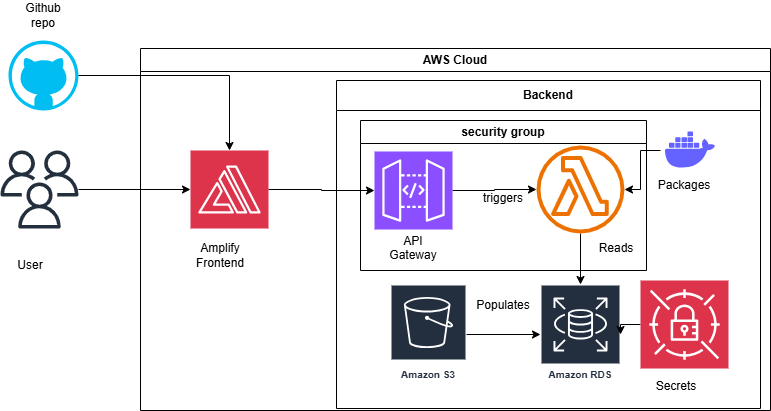

<div align="center">
  
</div>

# ⚡ EnergyPilot

A mobile-first Progressive Web App that helps residential customers in Luxembourg optimize their energy consumption and costs based on EPEX day-ahead electricity prices.

## 🎯 Overview

EnergyPilot empowers homeowners to take control of their energy usage by automatically scheduling smart devices (EVs, batteries, solar) to charge during low-price periods and discharge during peak-price times. Save money, reduce carbon emissions, and maximize your renewable energy investment.

**This project was developed during the [Watt the Hack Hackathon]

## ✨ Key Features

### 📊 Real-Time Price Monitoring
- View EPEX day-ahead electricity prices with 30-minute resolution
- Visual indicators for optimal charging/discharging windows
- Historical price trends and forecasting

### 🔌 Smart Device Control
Manage multiple energy devices from one interface:
- **Electric Vehicles (EV)**: Automated charging schedules
- **Home Battery Storage**: Smart charge/discharge cycles
- **Solar Panels**: Monitor production and optimize self-consumption

### 🧠 AI-Powered Strategies

Choose from intelligent optimization modes:
- **SmartShift (AI)**: Automated optimization for maximum savings
- **ECO Mode**: Prioritizes renewable energy and self-consumption
- **Peak Shaving**: Maximizes grid arbitrage during peak hours
- **Custom**: Create your own charging/discharging schedule

### 🔔 Negative Price Alerts
Get notified when electricity prices go negative – you're literally paid to use energy!

### 📈 Performance Insights
- Track daily, weekly, and monthly savings
- Monitor CO2 impact reduction
- Community rankings and leaderboards
- Performance badges and savings streaks

## 🚀 Getting Started

### Prerequisites

- Node.js 18+ 
- npm or yarn
- Modern web browser (Chrome, Safari, Firefox, Edge)

### Installation

1. Clone the repository:
```bash
git clone https://github.com/DavitPogosian/EnergyPilot.git
cd EnergyPilot
```

2. Install dependencies:
```bash
npm install
```

3. Run the development server:
```bash
npm run dev
```

4. Open [http://localhost:3000](http://localhost:3000) in your browser

### First-Time Setup

Complete the 3-step onboarding process:

1. **Configure Devices**: Add your EV, battery, or solar panels
2. **Set Preferences**: Define minimum battery levels and do-not-disturb hours
3. **Choose Strategy**: Select your default optimization mode

The app will automatically redirect you to the dashboard after setup.

## 📁 Project Structure

```
app/
├── onboarding/          # 3-step onboarding flow
├── dashboard/           # Main dashboard with price chart
├── devices/             # Device control interface
├── strategy/            # Strategy editor with timeline
├── notifications/       # Alert center
├── insights/            # Performance analytics
├── settings/            # App configuration
└── api/
    ├── prices/          # Mock EPEX price data
    ├── devices/         # Device status and control
    ├── strategy/        # Strategy application
    └── summary/         # Daily summary stats

components/
├── price-chart.tsx      # Interactive price visualization
├── timeline-editor.tsx  # Drag-to-select strategy editor
├── device-card.tsx      # Individual device control
├── bottom-nav.tsx       # Mobile navigation
└── ui/                  # shadcn/ui components

lib/
├── types.ts             # TypeScript interfaces
└── mock-data.ts         # Sample data generation
```

## 🔌 API Endpoints

### Get Energy Prices
```typescript
GET /api/prices?date=YYYY-MM-DD

Response:
{
  region: 'LU',
  date: '2025-11-25',
  prices: [
    { time: '00:00', price: 45.23 },
    { time: '00:30', price: 42.11 },
    ...
  ]
}
```

### Get All Devices
```typescript
GET /api/devices

Response:
{
  devices: [
    {
      id: 'ev-1',
      type: 'ev',
      name: 'Tesla Model 3',
      battery: 75,
      status: 'charging'
    },
    ...
  ]
}
```

### Control Device
```typescript
POST /api/devices/{id}/action

Body:
{
  action: 'charge_now' | 'stop' | 'auto' | 'discharge'
}

Response:
{
  success: true,
  newStatus: 'charging'
}
```

### Apply Strategy
```typescript
POST /api/strategy/apply

Body:
{
  intervals: [
    { start: '00:00', end: '06:00', action: 'charge' },
    ...
  ],
  devices: ['ev-1', 'battery-1']
}

Response:
{
  success: true,
  estimatedSavings: 12.45
}
```

## 🔗 Connecting to Real APIs

The app currently uses mock data. To connect to production systems:

### 1. EPEX Price Data

Edit `app/api/prices/route.ts`:
- Replace mock data with real EPEX API calls
- Use [ENTSO-E Transparency Platform](https://transparency.entsoe.eu/) or EPEX SPOT API
- Add authentication tokens

### 2. Device Control Integration

Edit `app/api/devices/[id]/action/route.ts`:
- Integrate with your smart home system (Tesla API, battery management systems)
- Implement device-specific protocols
- Add authentication and security measures

### 3. Strategy Engine

Edit `app/api/strategy/apply/route.ts`:
- Implement optimization algorithms (linear programming, dynamic scheduling)
- Connect to device scheduling systems
- Add constraint validation

### Environment Variables

Create a `.env.local` file:
```bash
EPEX_API_KEY=your_api_key
DEVICE_API_KEY=your_device_api_key
NEXT_PUBLIC_APP_URL=http://localhost:3000
```

## 📱 Progressive Web App

EnergyPilot is installable on mobile devices:

- **Manifest**: `/public/manifest.json`
- **Service Worker**: Auto-generated by Next.js
- **Offline Support**: Cached assets and data
- **Install Prompt**: Appears on supported browsers

### Installation on Mobile
1. Open the app in your mobile browser
2. Tap "Add to Home Screen" (iOS) or "Install App" (Android)
3. The app will appear as a native icon on your home screen

## 🛠️ Tech Stack

- **Framework**: Next.js 16 with App Router
- **UI**: Tailwind CSS v4 + shadcn/ui
- **Charts**: Recharts
- **State Management**: SWR for data fetching
- **Language**: TypeScript
- **Icons**: Lucide React

## 📱 Mobile-First Design

Built with mobile users in mind:

- Bottom navigation for thumb-friendly access
- Touch-optimized timeline editor
- Responsive charts and cards
- Large tap targets (minimum 44x44px)
- Optimized for screen widths 360px - 428px

## ♿ Accessibility

- ARIA labels on all interactive elements
- Full keyboard navigation support
- Screen reader optimized
- High contrast color themes
- Semantic HTML structure

## 🎮 Gamification Features

- **Community Rankings**: Compare performance with users in your area
- **Savings Streaks**: Track consecutive optimization days
- **Performance Badges**: Earn titles like "Elite Saver" and "Green Champion"
- **Leaderboards**: Monthly and all-time top performers

## 📦 Building for Production

```bash
# Create production build
npm run build

# Start production server
npm start
```

## ☁️ AWS Deployment

### Architecture Overview

EnergyPilot leverages AWS cloud infrastructure for scalable, secure, and automated deployment. The architecture consists of a serverless frontend, managed database, and Lambda-based computation engine.

<div align="center" style="background-color: white; padding: 16px;">
  
</div>

### AWS Services Used

- **Frontend Hosting**: AWS Amplify
  - Automatic deployment from GitHub main branch
  - CDN distribution for global performance
  - SSL/TLS certificate management

- **Compute**: AWS Lambda
  - Dockerized Lambda functions for cross-platform compatibility
  - Optimization and savings computation engine
  - Direct RDS access via security group configuration

- **Storage**: Amazon S3
  - Anonymized load profile datasets
  - Static asset storage

- **Database**: Amazon RDS (PostgreSQL)
  - User load profiles
  - Day-ahead electricity prices from ENTSO-E platform
  - Managed backups and scaling

- **API Management**: Amazon API Gateway
  - RESTful API endpoints
  - Request/response transformation
  - API throttling and caching

- **Security**: AWS Secrets Manager
  - Secure database credential storage
  - Automatic credential rotation

### Frontend Deployment

The frontend is built with Node.js (Next.js) and was initially created using v0 AI assistant, then customized for EnergyPilot's specific requirements.

**Continuous Deployment Pipeline:**
1. Code pushed to GitHub main branch
2. AWS Amplify automatically detects changes
3. Build process executes (`npm install` → `npm run build`)
4. New version deployed to production
5. CDN cache invalidated for instant updates

### Backend Architecture

#### Lambda Functions

The core computation logic is implemented in `scripts/lambda_function.py` and deployed as Docker containers to ensure consistency across development environments.

**Key Functionalities:**
- Daily value computation based on load profile and day-ahead prices
- Monthly grid income estimation
- Advanced savings estimation across multiple strategies

#### API Gateway Endpoints

```typescript
// Daily Value Computation
POST /api/compute/daily-value
Body: { loadProfile: [...], prices: [...] }

// Monthly Income Estimation
GET /api/compute/monthly-income?profile_id={id}

// Savings Estimation
POST /api/compute/savings
Body: { strategy: 'smartshift' | 'eco' | 'peak_shaving', intervals: [...], devices: [...] }
```

#### Database Schema

The PostgreSQL database in RDS contains:
- **Load Profiles**: Selected from anonymized S3 datasets
- **Day-Ahead Prices**: Historical and forecasted ENTSO-E data
- **User Preferences**: Device configurations and strategy settings
- **Performance Metrics**: Savings tracking and analytics

### Savings Estimation Strategies

The Lambda function computes savings across multiple strategies. Users can select from three optimization strategies in the UI, with a fourth baseline used for comparison:

#### 1. No Battery (Baseline for Comparison)
- Uses solar production first, then purchases from grid
- Excess solar energy sold at 70% of purchase price
- Used as baseline to calculate savings from other strategies
- **Note**: Not a user-selectable strategy in the UI

#### 2. SmartShift (AI)
User-defined schedule with intelligent battery management:
- **charge_from_grid**: Charge battery from grid and solar
- **self_consumption**: Prioritize solar → battery → grid
- **discharge_to_grid**: Sell battery energy back to grid
- **idle**: Use solar and grid as needed (no battery action)
- Automated optimization for maximum savings

#### 3. ECO Mode
Green energy prioritization:
- Only charges battery from excess solar production
- Never charges from grid
- Always prioritizes renewable energy sources
- Maximizes self-consumption

#### 4. Peak Shaving
Grid arbitrage optimization:
- Charges battery during low-price periods
- Discharges during expensive hours (peak prices)
- Maximizes revenue from price differentials
- Interval-based charging/discharging schedule

#### Custom Strategy
In addition to the above presets, users can create their own custom charging/discharging schedules using the timeline editor in the UI. Custom strategies are evaluated using the SmartShift computation logic with user-defined intervals.

### Lambda Deployment

Lambda functions are containerized using Docker for cross-platform compatibility:

```bash
# Build Docker image
docker build -t energypilot-lambda .

# Tag for ECR
docker tag energypilot-lambda:latest {account-id}.dkr.ecr.{region}.amazonaws.com/energypilot-lambda:latest

# Push to ECR
docker push {account-id}.dkr.ecr.{region}.amazonaws.com/energypilot-lambda:latest

# Deploy via AWS CLI or Console
aws lambda update-function-code \
  --function-name energypilot-compute \
  --image-uri {account-id}.dkr.ecr.{region}.amazonaws.com/energypilot-lambda:latest
```

### Security Configuration

- **RDS Security Groups**: Lambda functions configured with VPC access to RDS
- **Secrets Manager Integration**: Database credentials retrieved at runtime
- **IAM Roles**: Least-privilege access policies for all services
- **API Gateway Authentication**: API key and IAM-based authorization

### Data Flow

1. **Frontend Request**: User interacts with Next.js application
2. **API Gateway**: Routes request to appropriate Lambda function
3. **Lambda Processing**: 
   - Retrieves load profile from RDS
   - Fetches day-ahead prices from database
   - Accesses anonymized datasets from S3 if needed
   - Computes optimization based on selected strategy
4. **Response**: Results returned to frontend for visualization

### Environment Configuration

Key environment variables for Lambda functions:

```bash
# Database Connection
DB_HOST=your-rds-endpoint.rds.amazonaws.com
DB_NAME=energypilot
DB_SECRET_ARN=arn:aws:secretsmanager:region:account:secret:db-credentials

# API Configuration
API_GATEWAY_URL=https://api-id.execute-api.region.amazonaws.com/prod

# S3 Bucket
LOAD_PROFILES_BUCKET=energypilot-load-profiles

# AWS Region
AWS_REGION=eu-west-1
```

*[Security groups, IAM policies, encryption, compliance]*

---

**Built with ⚡ for the Watt the Hackathon**
